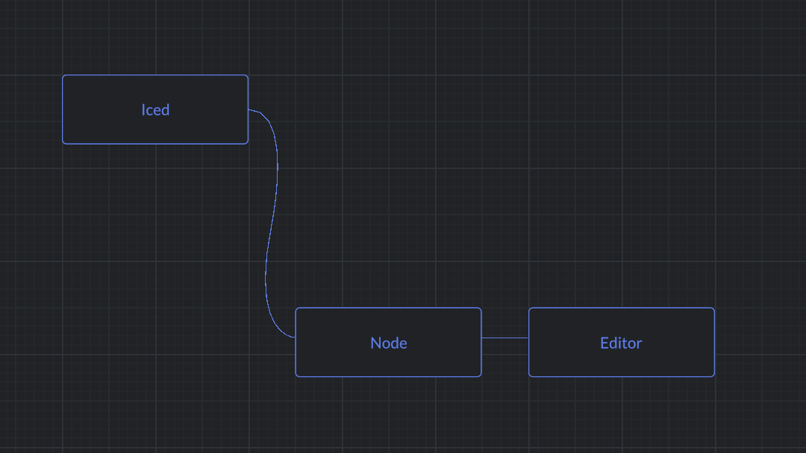

# Iced node editor

A node editor for [Iced](https://github.com/iced-rs/iced) GUI library. Supports iced_native renderer.

## Features

- [x] Nodes
- [x] Connections
- [x] Panning
- [x] Zooming
- [ ] Dragging nodes

## Usage

For examples please visit the [examples](./examples) directory.